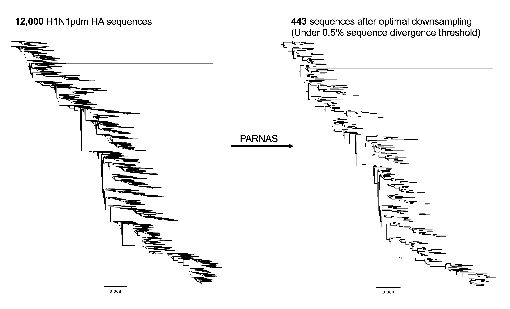
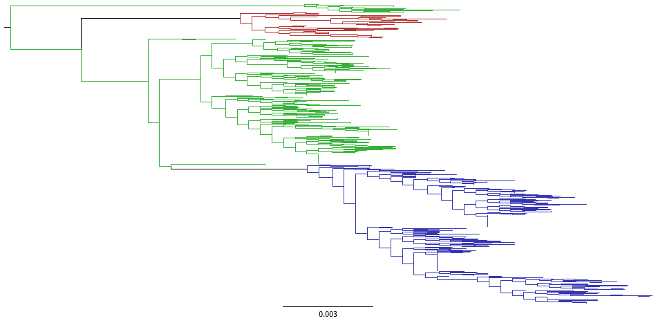
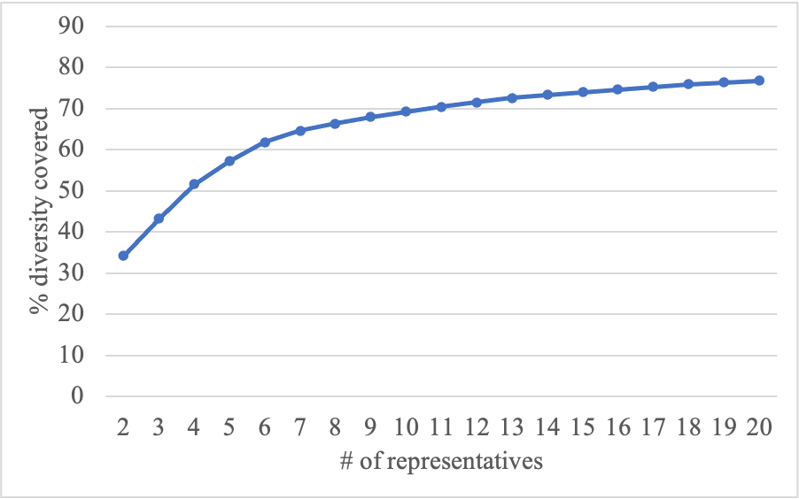
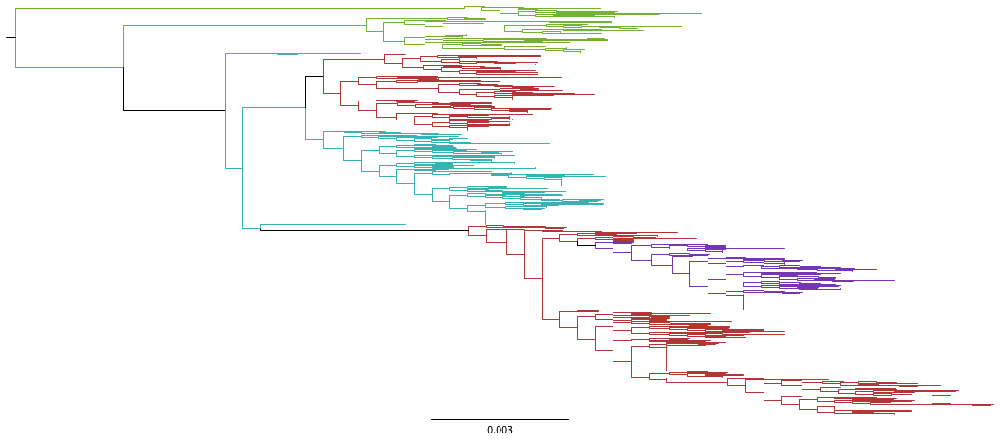
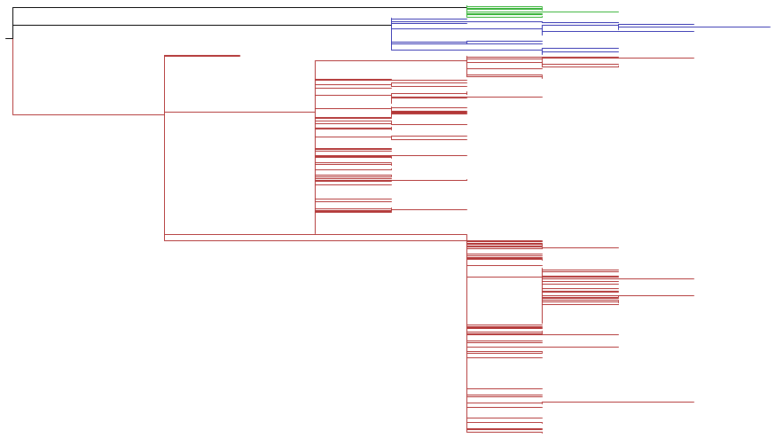

## PARNAS ##
PARNAS identifies taxa that best represent diversity on a phylogenetic tree
and can be used to
- Select most representative taxa
- Downsample a large phylogeny while optimally preserving the underlying diversity
- Reduce redundancy among genetic/genomic sequences
- Identify key diversity groups on a phylogeny

PARNAS solves urgent needs in virology/microbiology, such as
- Objectively finding representative strains for in-depth analyses (phenotypic characterization, Bayesian inference, etc.)
- Objective and flexible vaccine strain selection

PARNAS can take into account previously used representatives and a wide range of user's constraints.
Additionally, PARNAS is flexible in allowing
arbitrary weighing of taxa, e.g., based on predicted fitness/antigenic drift. Finally, PARNAS allows you to fine-tune
representation definition with a user-defined coverage radius.

Alternative methods currently exist to select taxa on phylogenetic trees (ADCL), or to reduce the number of taxa in a phylogeny (Treemer).
PARNAS is faster and more versatile than [ADCL](https://matsen.github.io/pplacer/generated_rst/rppr_min_adcl_tree.html#rppr-min-adcl-tree) by Matsen et al. (Systematic Biology 2013).
Similarly, PARNAS is faster than [Treemmer](https://github.com/fmenardo/Treemmer) (Menardo et al., BMC Bioinformatics 2018),
and our objective allows for reproducible and interpretable selections that are optimally representative.

**If you use PARNAS, please cite it as** 
*Markin, A., Wagle, S., Grover, S., Baker, A.L.V., Eulenstein, O. and Anderson, T.K., 2022. PARNAS: Objectively Selecting the Most Representative Taxa on a Phylogeny. bioRxiv.*

### Installation ###
PARNAS is available in PyPi and can be installed as
`pip install parnas`. Note that PARNAS requires Python 3.7 or higher.

PARNAS depends on dendropy and Biopython for phylogenetic and MSA manipulations, numpy and numba for just-in-time compilation of the critical algorithms into machine code, and (optionally) phylo-treetime to infer ancestral substitutions along tree edges. These dependencies will be installed automatically.

Alternatively, to install PARNAS, clone or download this project and run
`python setup.py install`.
## Tutorial ##

PARNAS has the following two main use-cases.
1. [Optimal downsampling](#optimal-downsampling-of-large-trees)
2. [Selecting best representatives](#selecting-best-representatives)

### Optimal downsampling of large trees ###
PARNAS lets you downsample a large phylogeny, while preserving all the diversity up to a user-specified threshold.

In particular, if you have a threshold parameter (e.g., 1% sequence divergence on a tree) PARNAS selects **the smallest** subset of taxa so that all other taxa are within that threshold distance to a representative.

The typical application of this feature is downscaling large densely-sampled trees.
In this example we will use a (human) H1N1pdm influenza A dataset with 12,000 taxa.
We optimally downsample it while preserving all diversity up to 99.5% sequence similarity, as follows:

`parnas -t genbank_H1N1pdm_USA.rooted.tre --cover --radius 0.005 --subtree H1N1pdm.r005.tre`

This results in a tree with only 443 taxa! Note that 0.005 distance on a maximum likelihood phylogeny serves here as a proxy for the 0.5% sequence divergence. A downsampled tree will be saved to a new `H1N1pdm.r005.tre` file.
The initial 12,000 taxa tree (`genbank_H1N1pdm_USA.rooted.tre`) can be found in the tutorial [folder](tutorial/H1N1pdm_2020.zip).

<!-- <object data="tutorial/figures/H1N1pdm-downsampling.pdf" type="application/pdf">
    <embed src="tutorial/figures/H1N1pdm-downsampling.pdf">
        
This browser does not support PDFs. You can view the trees <a href="tutorial/figures/H1N1pdm-downsampling.pdf">here</a>.

    </embed>
</object> -->

Below we discuss how PARNAS selects most representative taxa.

### Selecting best representatives ###
We use a human H1N1pdm dataset with HA sequences collected in 2020, downloaded from [IRD](fludb.org), for this tutorial.
The alignment and an inferred rooted tree can be found in the tutorial [folder](tutorial/H1N1pdm_2020.zip).

The basic usage of PARNAS is to find a fixed number of representative taxa, as follows: 
`parnas -t H1N1_human_2020_IRD.rooted.tre -n 3 --color "H1N1_parnas_n3.tre"` 
PARNAS will identify 3 best representative strains and save a colored tree to H1N1_parnas_n3.tre.
Opening this tree in FigTree, will show the representatives and their respective clusters of strains with different colors. Below is the `H1N1_parnas_n3.tre` output tree, when opened in FigTree. Each color corresponds to one PARNAS-selected representative and the area of the tree it represents.

Additionally, in the output PARNAS specifies the amount of overall diversity covered by the chosen representatives, which is 43% for our dataset.

#### Determining the right number of representatives ####
The "diversity covered" metric calculated by PARNAS is a useful tool to determine how many representatives is sufficient.
To find the amount of diversity covered by different numbers of representatives, you can choose a large enough n, e.g., n=20, and run 
`parnas -t H1N1_human_2020_IRD.rooted.tre -n 20 --diversity "diversity_scores.csv"` 
This command will save a CSV file with optimal diversity scores for n between 2 and 20. For our dataset, it shows that only 6 representative strains are needed to cover over 60% of the overall diversity. Opening the CSV file in Excel/Numbers, one can then construct the following graph to better visualize the data.

#### Using prior representatives ####
It often may be useful to find new representatives, while specifying the previous taxa/strains that were treated as representatives. In our H1N1 dataset, we included two latest H1N1 vaccine strains, A/Wisconsin/588/2019 and A/Hawaii/70/2019. Using PARNAS we can fix these two strains as 'prior' representatives and find new representatives, so that old and new representatives work optimally together. We use `--prior` option to notify PARNAS of the two vaccine strains by specifying a regular expression matching their names in our dataset (which start with "Vaccine|"): 
`parnas -t H1N1_human_2020_IRD.rooted.tre -n 3 --prior "Vaccine.*" --color "H1N1_parnas_n3_vaccines.tre"` 
The result is shown in a tree below. PARNAS colors the prior representatives and the respective parts of the tree in red.

#### Specifying a coverage radius ####
You can notify PARNAS that a single taxon 'covers' other taxa within a fixed radius (using `--radius` option). PARNAS will then find representatives, which together cover as much diversity as possible. Alternatively, PARNAS can find the minimum number of representatives that jointly cover *all* diversity on the tree (`--cover` option). This feature can be used to optimally reduce the redundancy in your dataset. Moreover, this feature was motivated by applications in virology, where evolutionary distance often correlates with antigenic drift. For example, in swine influenza A virus research, 5% (amino acid) divergence between HA sequences is considered a correlate of loss in cross-reactivity between strains. Therefore, specifying a radius on a tree corresponding to ~4% sequence divergence, can help identify good vaccine candidates.

To further facilitate this process, PARNAS can take amino acid sequence alignment and pass it to [TreeTime](https://treetime.readthedocs.io/en/latest/) to find ancestral AA substitutions along the tree edges. It will then re-scale the tree, so that edge lengths will reflect the number of substitutions along that edge, which will help specify a 4% divergence radius in terms of the # of amino acid substitutions.

`parnas -t H1N1_human_2020_IRD.rooted.tre --cover --threshold 96 --aa H1N1_human_2020_IRD.ha1.aln --color "parnas_96coverage.tre"`

In the above command we pass the AA alignment of HA1 sequences from our dataset with the `--aa` option, and specify the 96% threshold (i.e., 4% sequence divergence). Note that `--threshold` works as a substitute for `--radius`, when you would like PARNAS to use the alignment information and re-scale the tree. Running this command will show that a single strain (A/Wisconsin/32/2020) is sufficient to cover all diversity on our tree.

Next, we use a more restrictive threshold of 97% and also add the vaccine strains as the prior representatives. This way PARNAS can indicate the areas of the tree, which are not covered by the vaccine strains and suggest new representatives to complement the vaccine strains.

`parnas -t H1N1_human_2020_IRD.rooted.tre --cover --threshold 97 --aa H1N1_human_2020_IRD.ha1.aln --color "parnas_97coverage_vaccines.tre" --prior "Vaccine.*"`

Opening `parnas_97coverage_vaccines.tre` in FigTree will show us that there are two clades in the tree, which are not covered by vaccine strains (the green and blue clades). Note that the tree was re-scaled by PARNAS.

#### Other functionality ####
- Specify weights for taxa, so that taxa/strains with larger weights are better represented.
- Flexibly exclude taxa to either fully ignore them or to not consider them as potential representatives.

## PARNAS usage ##

`parnas -t TREE [-n SAMPLES] [other options]`

The input tree should be in nexus or newick format.

For a detailed reference on PARNAS options run `parnas -h` or see below.

*General options*

| Option | Description |
| --- | --- |
|--radius | Specify a radius (distance on a tree) so that every representative covers all diversity within that radius. PARNAS will then choose representatives that optimally cover as much diversity as possible |
| --prior | Specify prior representatives with a regex. PARNAS will then identify representatives of 'new' diversity |
| --weights | Add a CSV file specifying weights for some or all taxa/strains |
| --cover | Instead of specifying the number of representatives, specify the radius and PARNAS will find representative that cover all diversity on the tree |

*Output options (combining output options is allowed)*

| Option | Description |
| --- | --- |
| --color | Specify an output path, where a colored tree will be saved. PARNAS will highlight the chosen representatives and color-partition the tree respective to the representatives. If prior representatives are specified, they (and the subtrees they represent) will be colored red.|
| --diversity | Specify an output path, where a CSV will be saved with diversity scores for all k (number of representatives) from 2 to n. Can be used to choose the right number of representatives for a dataset |
| --subtree | Specify a path, where a subtree with the sampled representatives will be saved (in NEXUS format) |

*Options to exclude/constrain taxa*

| Option | Description |
| --- | --- |
| --exclude-rep | REGEX. Matching taxa will not be chosen as representatives, but they will contribute to the objective function |
| --exclude-obj | REGEX. Matching taxa can be selected, but will not contribute to the objective function (the opposite of --exclude-rep) |
| --exclude-fully | REGEX. Matching taxa will be completely ignored by PARNAS |
| --constrain-fully | REGEX. Opposite to '--exclude-fully', i.e., only the matching taxa will be considered by PARNAS |

*Options to control sequence divergence*

| Option | Description |
| --- | --- |
| --threshold | Number between 0 and 100. The sequence similarity threshold that works as --radius. For example, "95" will imply that each representative covers all leaves within 5% divergence on the tree. To account for sequence divergence, PARNAS will run TreeTime to infer ancestral substitutions along the tree edges and re-weigh the edges based on the number of substitutions on them. A sequence alignment (--nt or --aa) must be specified with this option |
| --nt | Path to nucleotide sequence alignment associated with the tree tips |
| --aa | Path to amino acid sequence alignment associated with the tree tips |
